# TCP Three-Way Handshake Deep Analysis & Network Investigation Report

> **Project Type:** Cyber Security / Networking Analysis  
> **Level:** Beginner to Intermediate  
> **Status:** Completed

---

# Objective

Capture a real TCP Three-Way Handshake using Wireshark, analyze every packet at the TCP flag and sequence-number level, then investigate the remote IP address using multiple OSINT and Threat Intelligence platforms to verify whether the communicating host is legitimate.

This project follows a real SOC Analyst investigation workflow where network traffic is validated before it is considered trusted.

---

# Environment

| Component | Value |
|-----------|-------|
| Capture Tool | Wireshark |
| Network Interface | Wi-Fi |
| Local Host | `192.168.0.102` |
| Remote Host | `98.70.192.224` |
| Organization | Microsoft Corporation |
| Cloud Provider | Microsoft Azure |
| Destination Location | Pune, Maharashtra, India |
| Protocol | TCP |
| Destination Port | `443 (HTTPS)` |

---

# Wireshark Display Filter

```wireshark
tcp.flags.syn == 1 or (tcp.seq == 1 and tcp.ack == 1 and tcp.len == 0)
```

---

# Local Network Verification

## Command

```cmd
ipconfig
```

## Evidence

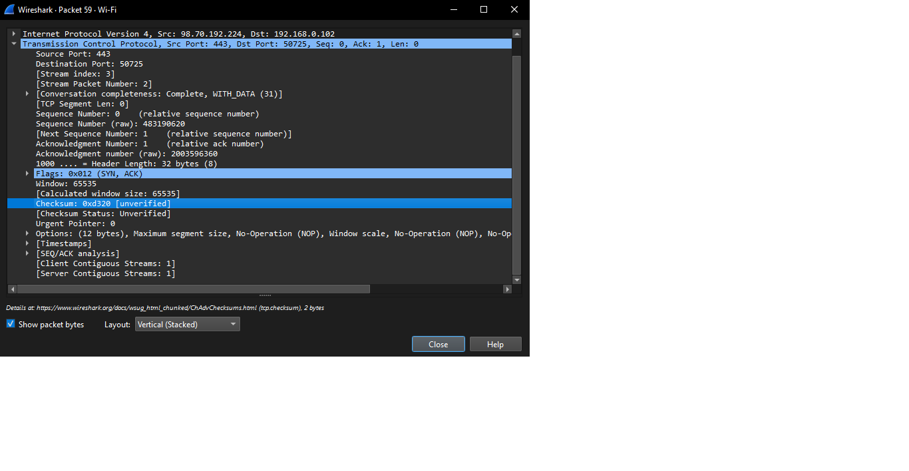

### Result

Confirmed local IPv4 address:

```text
192.168.0.102
```

This matches the source IP observed throughout the packet capture, confirming that the traffic belongs to the local machine rather than a third-party capture.

---

# Step 1 — Capturing the TCP Handshake

Applied the Wireshark display filter to isolate only handshake-related packets.

## Evidence

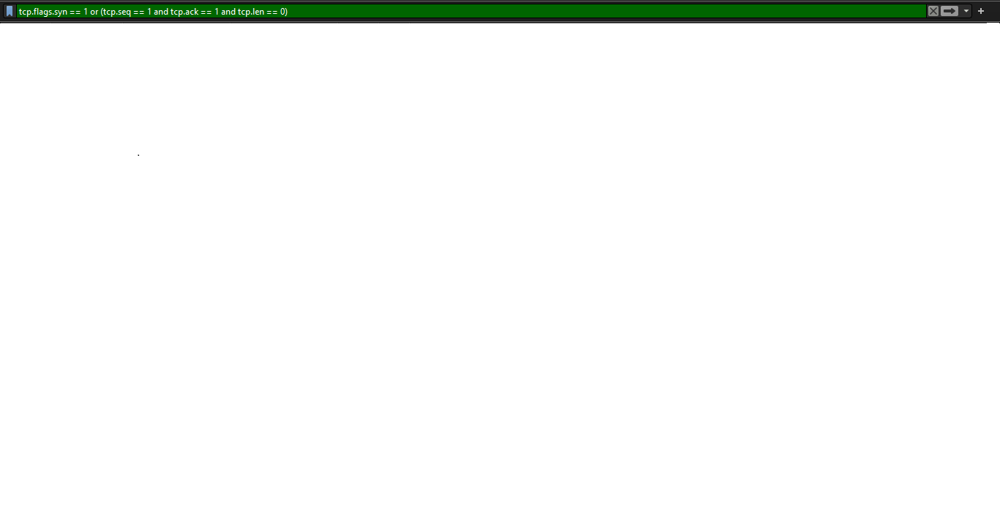

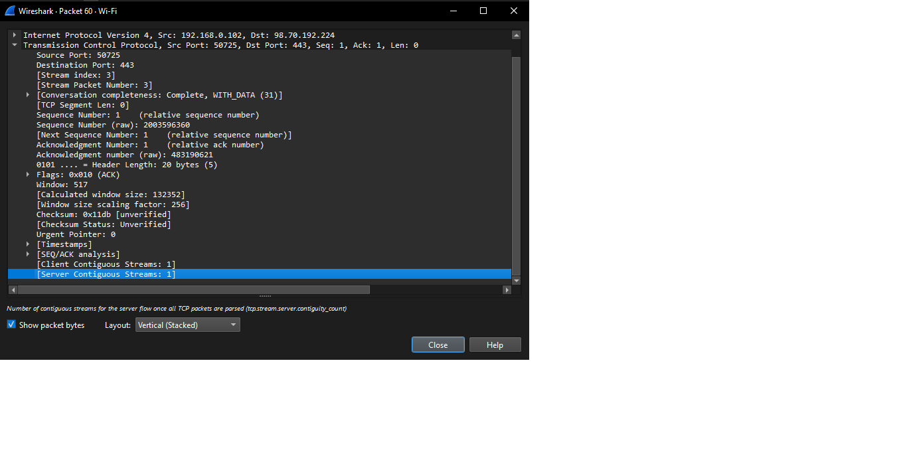

The filtered capture isolated the exact handshake sequence.

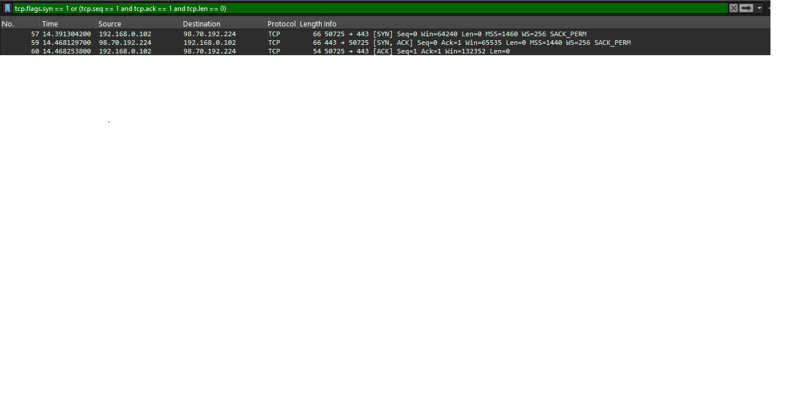

Frames identified:

```text
Frame 57 → SYN

Frame 59 → SYN-ACK

Frame 60 → ACK
```

---

# Step 2 — SYN Packet (Client → Server)

Client initiates the TCP connection.

## Evidence

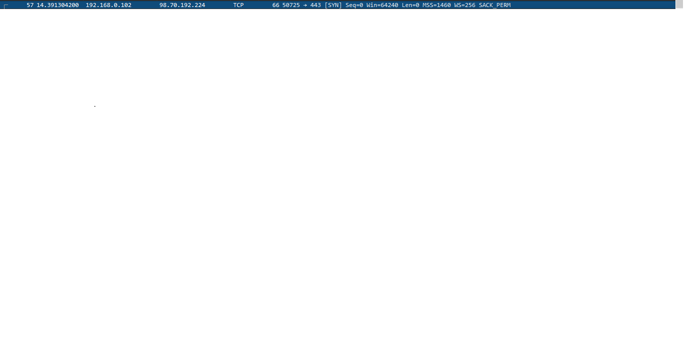

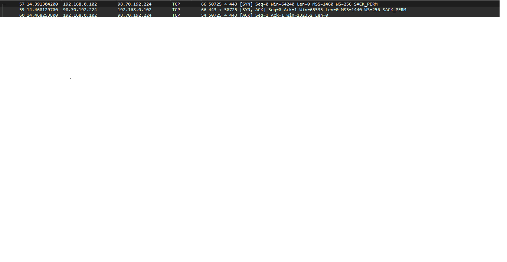

### Packet Information

```text
Source IP      : 192.168.0.102

Destination IP : 98.70.192.224

Destination Port : 443

Flags          : 0x002 (SYN)

Sequence Number: 0

Window Size    : 64240

MSS            : 1460

Window Scaling : 256

SACK Permitted : Yes
```

### Analysis

The client requests to establish a TCP connection while advertising its TCP capabilities including:

- Maximum Segment Size (MSS)
- Window Scaling
- Selective Acknowledgement (SACK)

No application data is transmitted during this packet.

---

# Step 3 — SYN-ACK Packet (Server → Client)

The server accepts the connection request.

## Evidence

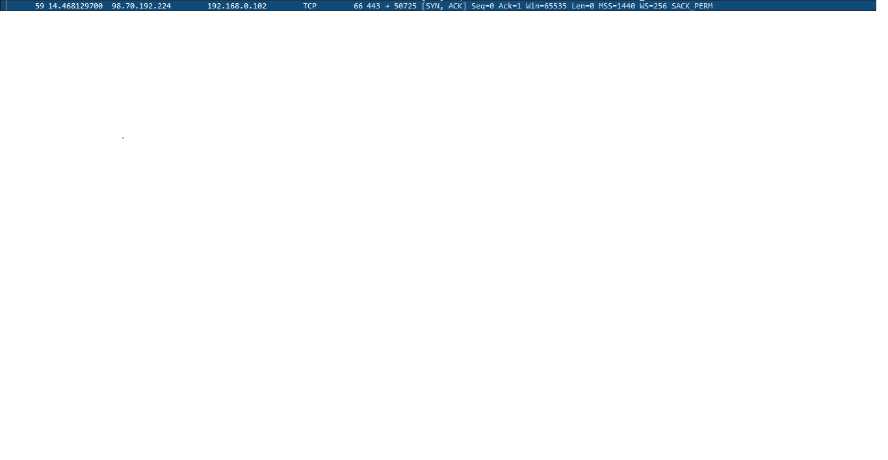

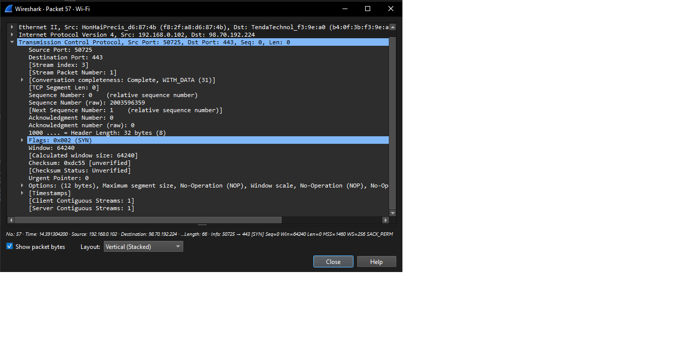

### Packet Information

```text
Flags          : 0x012 (SYN, ACK)

Sequence Number: 0

Acknowledgment : 1

Window Size    : 65535

MSS            : 1440
```

### Analysis

The server acknowledges receipt of the client's SYN packet while simultaneously sending its own SYN request.

This confirms:

- Client request received
- Server ready for communication
- Server TCP options negotiated

---

# Step 4 — ACK Packet (Client → Server)

Client completes the handshake.

## Evidence

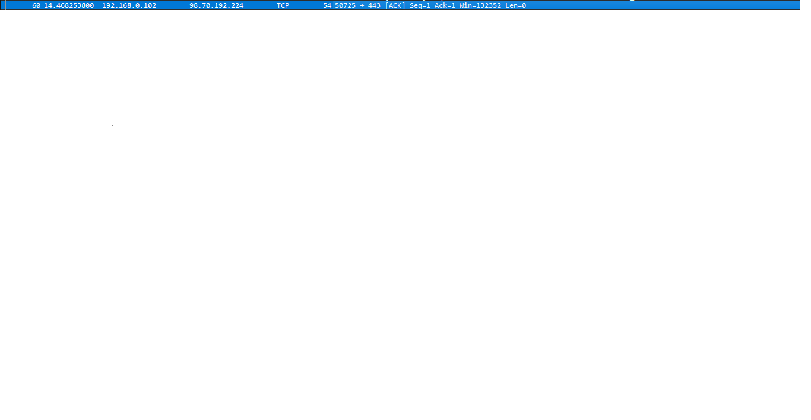

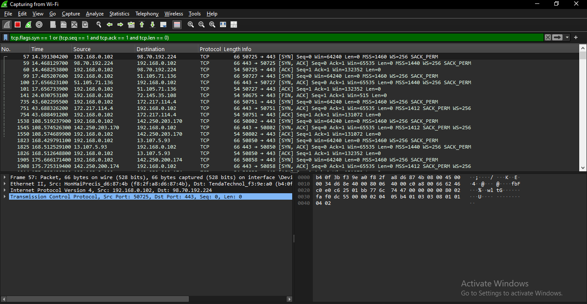

### Packet Information

```text
Flags              : 0x010 (ACK)

Sequence Number    : 1

Acknowledgment     : 1

Calculated Window  : 132352
```

### Analysis

The client acknowledges the server's SYN packet.

At this point:

```text
TCP Connection State

ESTABLISHED
```

Application data can now begin flowing between both hosts.

---

# Complete TCP Handshake

```text
Client (192.168.0.102)                     Server (98.70.192.224:443)

        SYN (Seq=0)
---------------------------------------------->

                        SYN + ACK (Seq=0 Ack=1)
<----------------------------------------------

        ACK (Seq=1 Ack=1)
---------------------------------------------->

             TCP CONNECTION ESTABLISHED
```

---

# Step 5 — Source IP Verification

Source verification was performed using Windows networking utilities.

```cmd
ipconfig
```

Verified source address:

```text
192.168.0.102
```

Result:

- Source IP matches packet capture
- Traffic originated from the local host
- No indication of spoofed or relayed traffic

---

# Step 6 — Destination IP Investigation

Destination IP:

```text
98.70.192.224
```

---

## WHOIS Lookup

Query:

```text
whois.arin.net/rest/ip/98.70.192.224
```

Evidence:

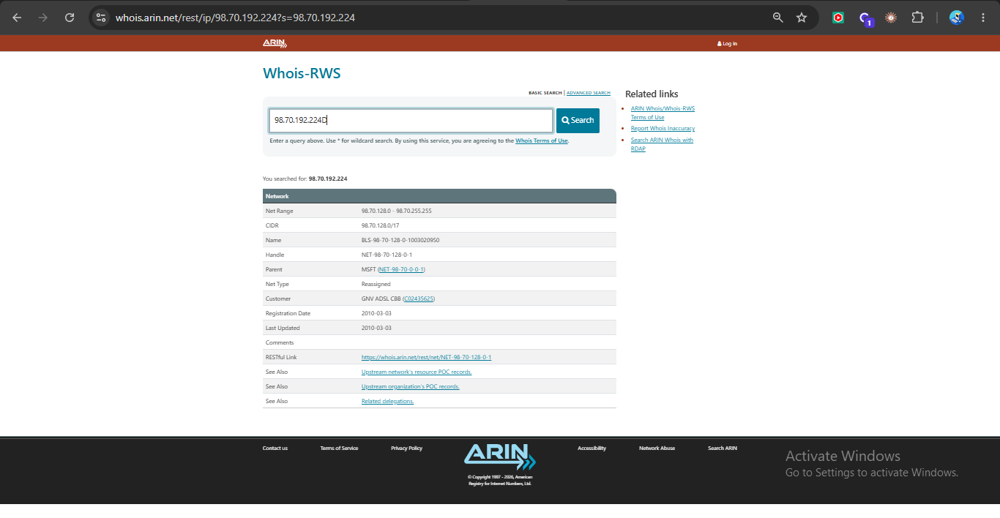

### Findings

```text
Network Range

98.70.128.0 - 98.70.255.255
```

```text
Organization

Microsoft Corporation
```

Result:

The IP belongs to Microsoft's officially registered address space.

---

# Multi-Source Geolocation Verification

The destination IP was validated across multiple independent geolocation providers.

Evidence

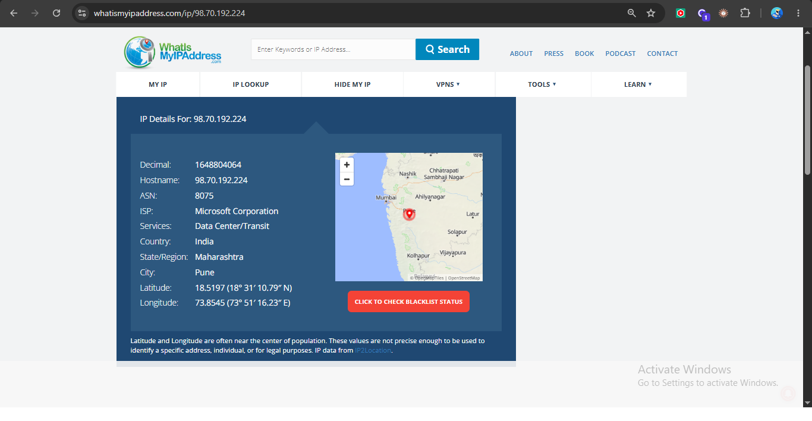

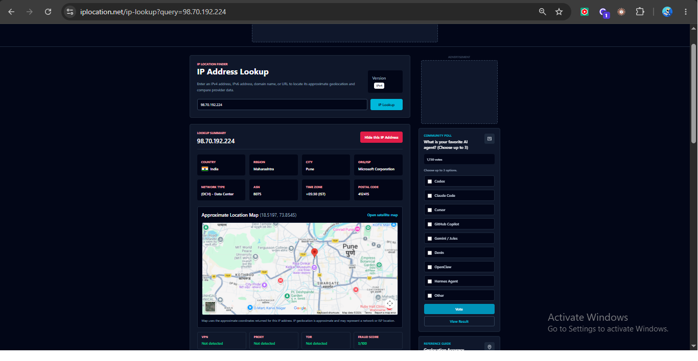

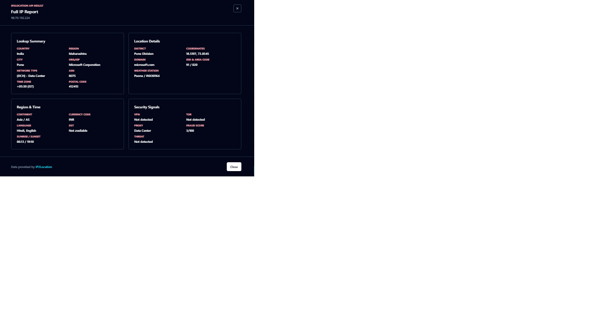

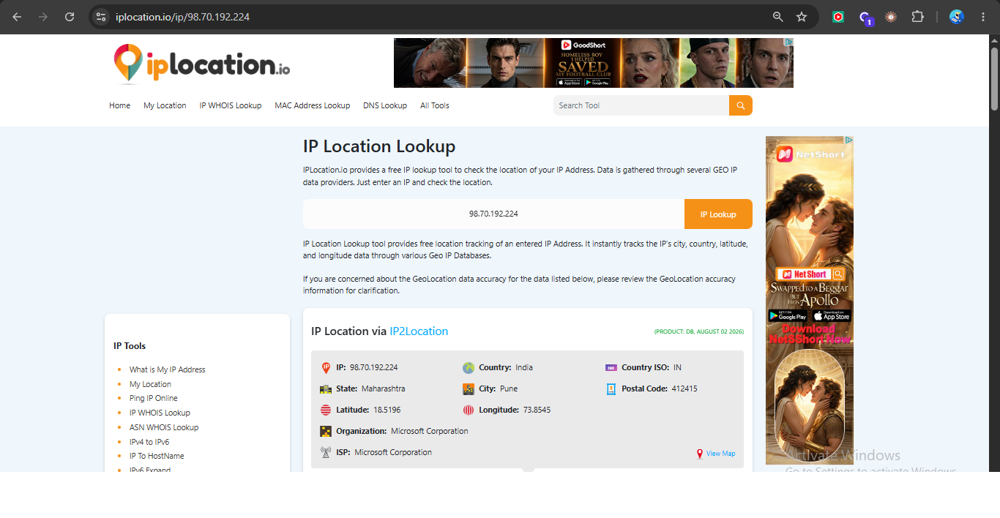

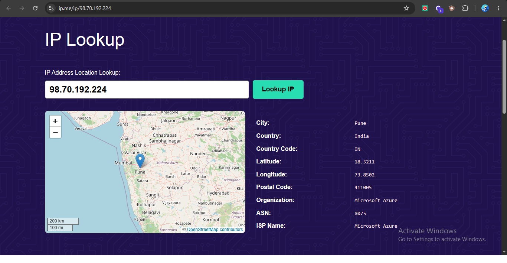

Consensus across providers:

```text
Organization

Microsoft Corporation
```

```text
Cloud Provider

Microsoft Azure
```

```text
ASN

8075
```

```text
Location

Pune

Maharashtra

India
```

Using multiple providers reduces the possibility of relying on outdated or inaccurate geolocation databases.

---

# Step 7 — Connectivity Validation

## Ping Test

Command

```cmd
ping 98.70.192.224
```

Evidence

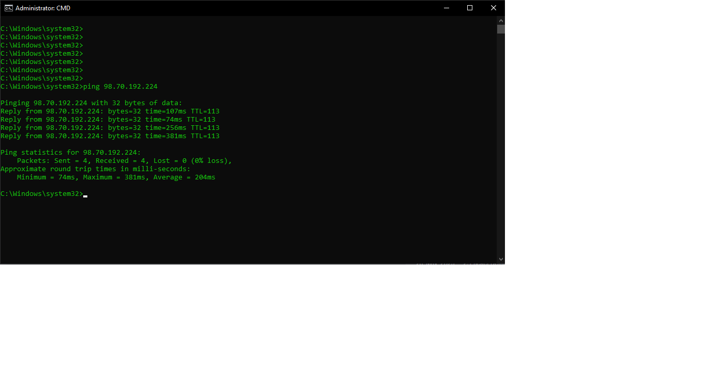

Results

```text
Packets Sent     : 4

Packets Received : 4

Packet Loss      : 0%

Average RTT      : 204 ms
```

Result

The host is reachable and responding normally.

---

## Traceroute

Command

```cmd
tracert 98.70.192.224
```

Evidence

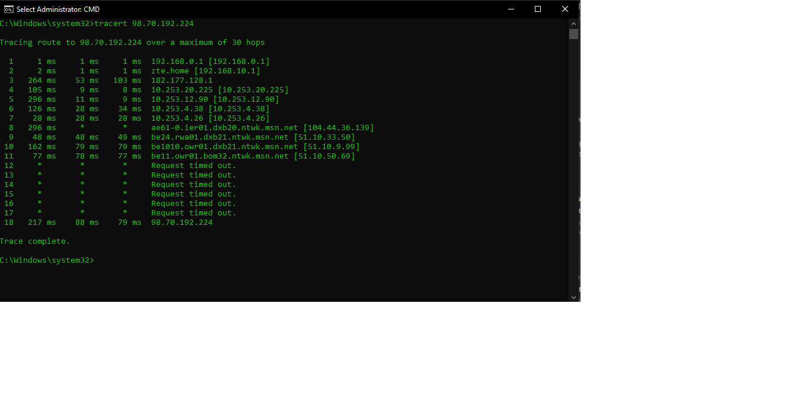

Observation

```text
18 network hops

Route traverses ISP infrastructure

Transitions into Microsoft's network

Destination successfully reached
```

The routing path is consistent with legitimate Microsoft Azure infrastructure.

---

# Step 8 — Threat Intelligence Analysis

## VirusTotal Investigation

Evidence

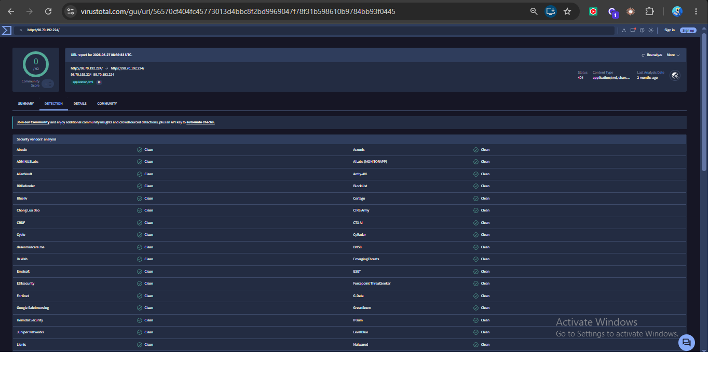

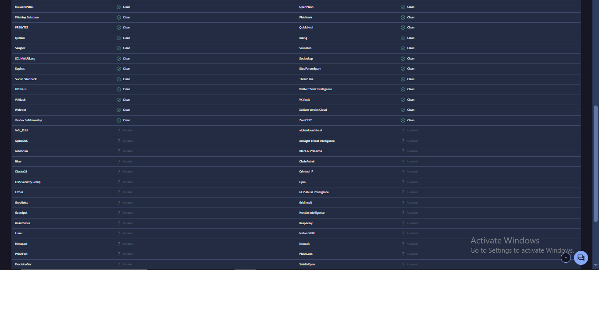

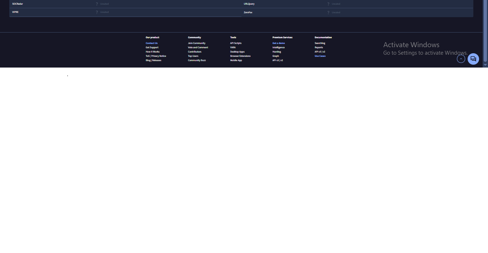

Result

```text
Detections

0 / Multiple Security Vendors
```

No known malicious history associated with the IP.

---

## Cisco Talos Intelligence

Evidence

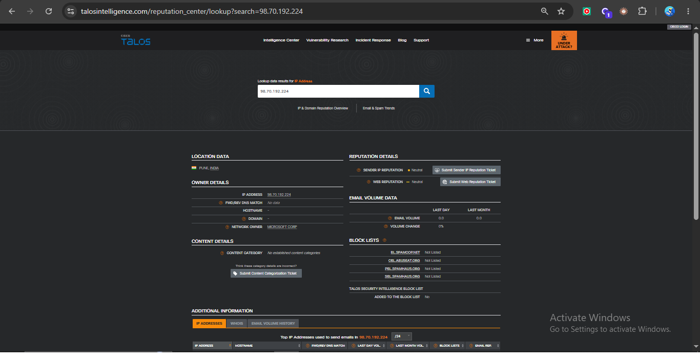

Results

```text
Sender Reputation

Neutral
```

```text
Web Reputation

Neutral
```

```text
Blocklists

SPAMCOP     : Clean

ABUSEAT     : Clean

SPAMHAUS    : Clean
```

The IP has a clean reputation across Talos intelligence services.

---

# Step 9 — Shodan Investigation

Evidence

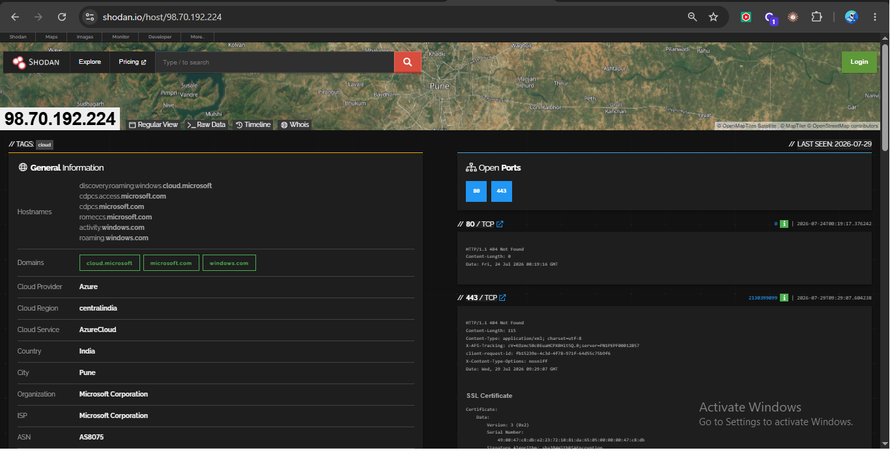

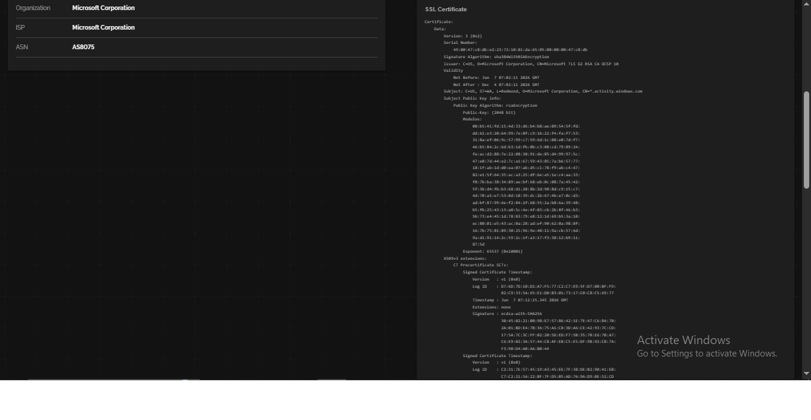

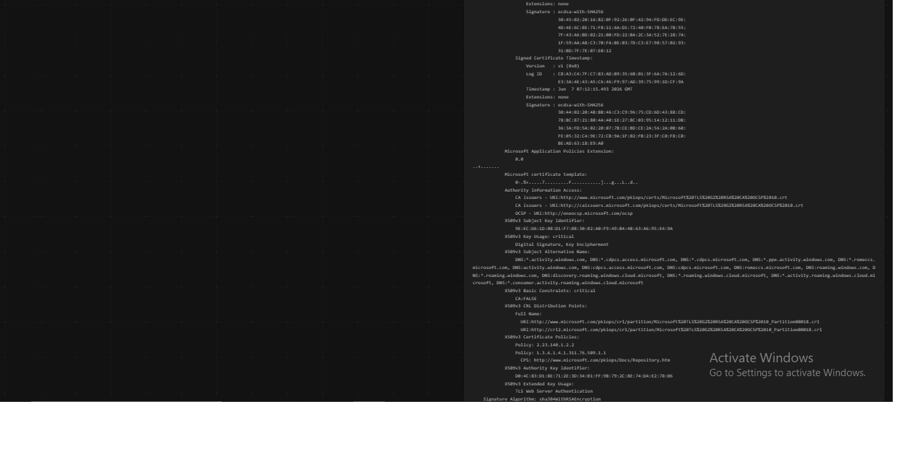

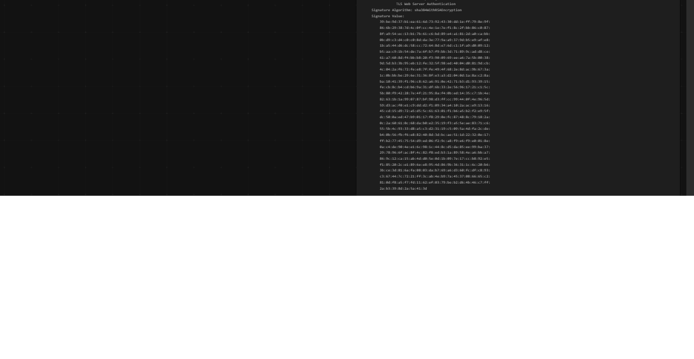

## Findings

### Open Ports

```text
80

443
```

Only standard web service ports are exposed.

---

### TLS Certificate

```text
Issuer

Microsoft TLS G2 RSA CA CSP 10
```

Certificate validity was confirmed.

---

### Hostnames

```text
*.activity.windows.com

*.roaming.windows.com
```

These domains belong to Microsoft's cloud infrastructure.

---

# Overall Security Assessment

Every independent verification layer reached the same conclusion.

```text
WHOIS

✓ Microsoft Owned
```

```text
Geolocation

✓ Microsoft Azure

✓ Pune, India
```

```text
Ping

✓ Reachable
```

```text
Traceroute

✓ Legitimate Microsoft Routing
```

```text
VirusTotal

✓ Zero Detections
```

```text
Cisco Talos

✓ Neutral Reputation
```

```text
Shodan

✓ Valid Microsoft Certificate

✓ Minimal Attack Surface
```

Overall Conclusion:

```text
The investigated IP address belongs to legitimate Microsoft Azure infrastructure.

No indicators of compromise, malicious reputation, suspicious routing, or unauthorized ownership were identified.

The communication observed during the TCP Three-Way Handshake represents normal HTTPS traffic with a trusted Microsoft endpoint.
```

---

# Skills Demonstrated

```text
TCP/IP Fundamentals

TCP Three-Way Handshake Analysis

Wireshark Packet Inspection

TCP Flag Interpretation

Sequence & Acknowledgment Number Analysis

Windows Network Diagnostics

WHOIS Investigation

OSINT Investigation

Multi-source Geolocation Validation

Ping & Traceroute Analysis

Threat Intelligence Investigation

VirusTotal Analysis

Cisco Talos Intelligence

Shodan Reconnaissance

TLS Certificate Validation

Network Documentation

Security Reporting
```

---

# Key Learning Outcomes

- Understood how the TCP Three-Way Handshake establishes reliable communication.
- Learned to interpret raw TCP flags directly from packet details.
- Verified IP ownership using WHOIS records.
- Cross-validated geolocation using multiple independent sources.
- Confirmed host availability using Ping and Traceroute.
- Investigated reputation using VirusTotal and Cisco Talos.
- Validated exposed services and TLS certificates using Shodan.
- Practiced documenting a complete network investigation following a SOC Analyst methodology.

---

# Future Improvements

- Analyze handshakes involving suspicious or malicious IP addresses.
- Compare legitimate versus malicious network behavior.
- Import packet capture data into Splunk for SIEM analysis.
- Create custom detection rules based on TCP handshake anomalies.
- Expand the investigation to include DNS, TLS, and HTTP traffic analysis.

---
